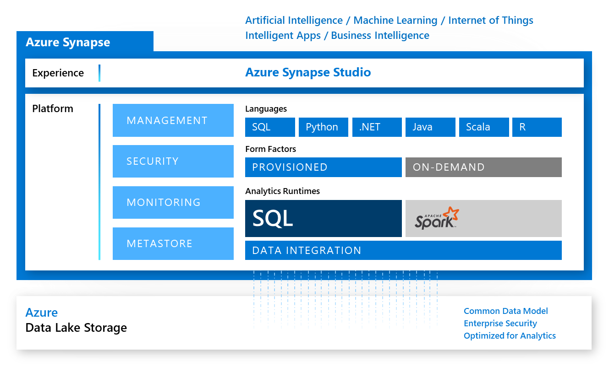

#  Azure Synapse Analytics Demos
This repository includes all code of my Azure Synapse Analytics demo environment. I use the source control capabilities of Synapse Analytics to keep this repositoy in sync with my work, like described in this [Synapse Analytics documentation article](https://docs.microsoft.com/en-us/azure/synapse-analytics/cicd/source-control).

## Experience a new class of analytics
Azure Synapse Analytics is a limitless analytics service that brings together data integration, enterprise data warehousing, and big data analytics. It gives you the freedom to query data on your terms, using either serverless or dedicated resources—at scale. Azure Synapse brings these worlds together with a unified experience to ingest, explore, prepare, manage, and serve data for immediate BI and machine learning needs.

For more info, visit [Azure Synapse Analytics product information](https://azure.microsoft.com/en-us/services/synapse-analytics/)

## Polaris Distributed Query Engine
In the [linked paper](https://aka.ms/synapse-dqp), Microsoft describes the Polaris distributed SQL query engine in Azure Synapse. It is the result of a multi-year project to rearchitect the query processing framework in the SQL DW parallel data warehouse service, and addresses two main goals:

- converge data warehousing and big data workloads, and 
- separate compute and state for cloud-native execution.

You can download the paper at [https://aka.ms/synapse-dqp](https://aka.ms/synapse-dqp)

---

## :ambulance: Support Information
For further information about this project, how to [contribute](CONTRIBUTING.md), or how to contact me, please have a look at the [support document](SUPPORT.md) of this repository. It also contains information about [security related topics](SECURITY.md), [licensing](LICENSE.md), and more.  

## :man_judge: Disclaimer
THE CONTENT OF THIS REPOSITORY IS PROVIDED "AS IS", WITHOUT WARRANTY OF ANY KIND, EXPRESS OR IMPLIED, INCLUDING BUT NOT LIMITED TO THE WARRANTIES OF MERCHANTABILITY, FITNESS FOR A PARTICULAR PURPOSE AND NONINFRINGEMENT. IN NO EVENT SHALL THE AUTHORS BE LIABLE FOR ANY CLAIM, DAMAGES OR OTHER LIABILITY, WHETHER IN AN ACTION OF CONTRACT, TORT OR OTHERWISE, ARISING FROM, OUT OF OR IN CONNECTION WITH THE CONTENT OF THIS REPOSITORY OR THE USE OR OTHER DEALINGS BY CONTENT OF THIS REPOSITORY.