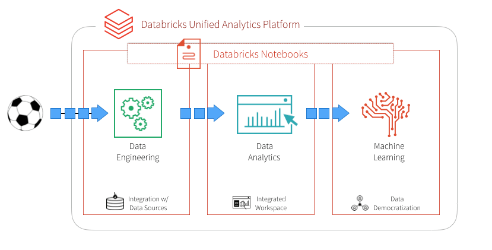

# European Soccer Events Analysis

A soccer game or any other sport generates many events, which help solve a number of use cases across the Sports and Media & Entertainment industries:
  * Like what on-field playing conditions and events (passes, positions etc.) leads to more goals/touch-downs etc.*
  * Or what does the win-loss percentage looks like with different combinations of players in different on-field positions*
  * Or what does a sportsperson's performance graph look like across the years/seasons and teams etc.*

This demo uses a European Soccer Games events dataset, and demonstrates:
  * End-to-end Data Engineering pipeline including data extraction, transformation and loading*
  * How to answer business questions by analyzing the transformed data - using a combination of Spark SQL and Visualizations*
  * Usage of Gradient-boosted tree classifier to predict events of most significance (goals in a soccer game)*
  
We start out by creating an ETL notebook, where the two CSV datasets are transformed and joined into a single Parquet data layer, which enables us to utilize DBIO caching feature for high-performance big data queries.

> Blog Post: https://databricks.com/blog/2018/07/09/analyze-games-from-european-soccer-leagues-with-apache-spark-and-databricks.html

## Data Sourcing/Extraction

Dataset has been downloaded from [**Kaggle**](https://www.kaggle.com/secareanualin/football-events). It provides a granular view of 9,074 games, from the biggest 5 European football (soccer) leagues: England, Spain, Germany, Italy, France, from 2011/2012 season to 2016/2017 season as of 25.01.2017. This is what the schema looks like:

| Column Name | Colum Description |
| ----------- | ----------------- |
| id_odsp | unique identifier of game (odsp stands from oddsportal.com) |
| id_event | unique identifier of event (id_odsp + sort_order) |
| sort_order | chronological sequence of events in a game |
| time | minute of the game |
| text | text commentary |
| event_type | primary event, 11 unique events |
| event_type2 | secondary event, 4 unique events |
| side | Home or Away team |
| event_team | team that produced the event. In case of Own goals, event team is the team that benefited from the own goal |
| opponent | opposing team |
| player | name of the player involved in main event |
| player2 | name of player involved in secondary event |
| player_in | player that came in (only applies to substitutions) |
| player_out | player substituted (only applies to substitutions) |
| shot_place | placement of the shot, 13 possible placement locations |
| shot_outcome | 4 possible outcomes |
| is_goal | binary variable if the shot resulted in a goal (own goals included) |
| location | location on the pitch where the event happened, 19 possible locations |
| bodypart | 3 body parts |
| assist_method | in case of an assisted shot, 5 possible assist methods |
| situation | 4 types |